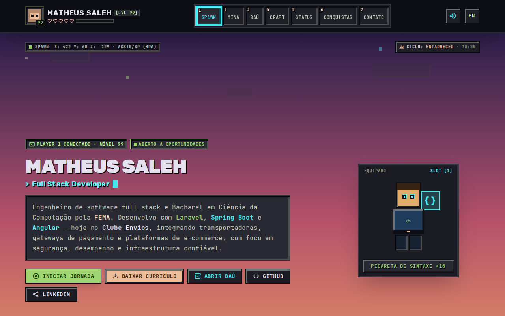
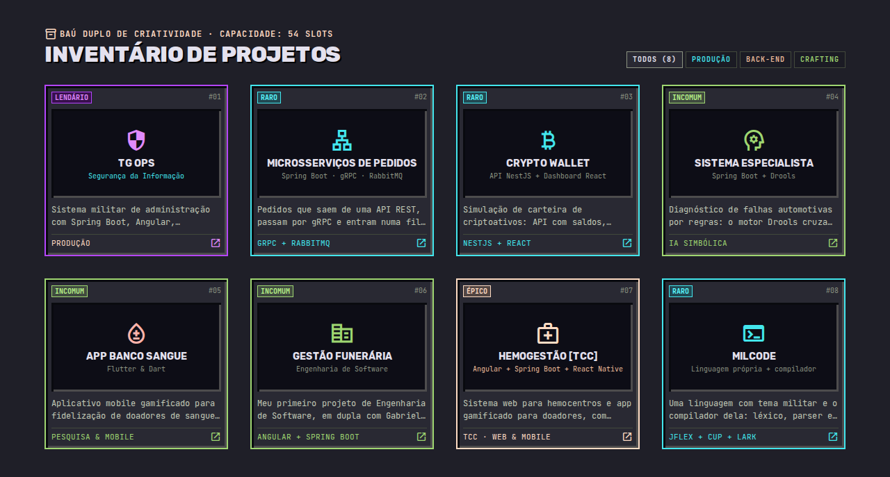
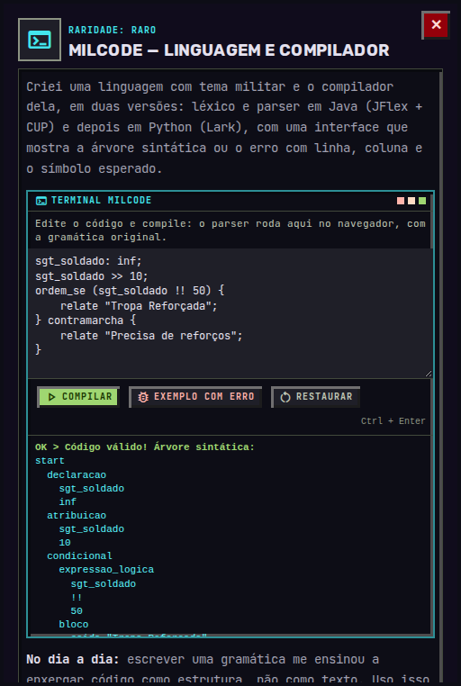
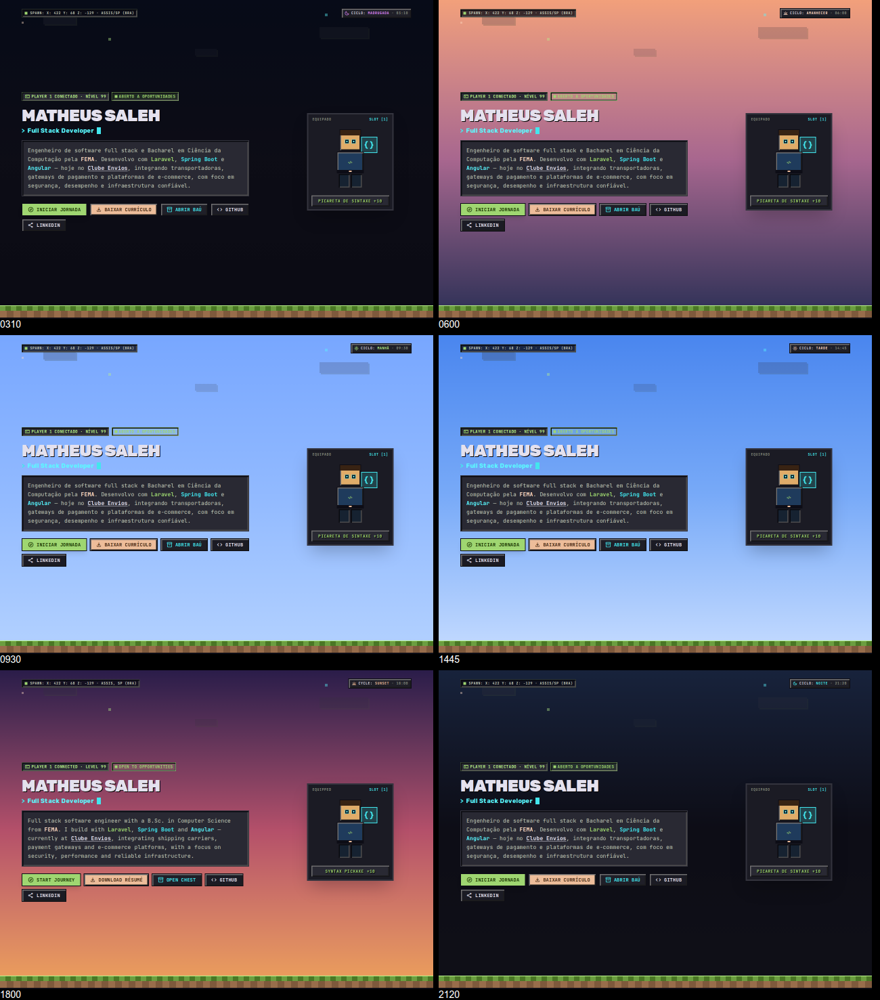
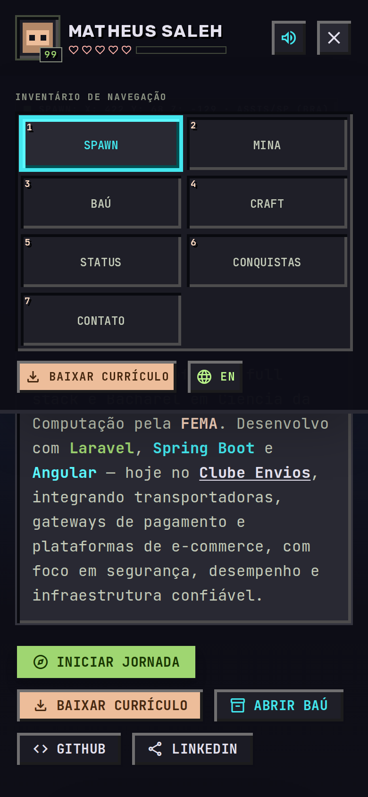

# Matheus Saleh — Portfólio

Portfólio com tema de jogo voxel: a carreira vira uma mina, os projetos ficam num baú e as skills numa mesa de criação. Feito em **Next.js 16**, **React 19** e **Tailwind CSS v4**, em português e inglês.



## Funcionalidades

- **Duas línguas.** O site inteiro em português (`/`) e em inglês (`/en`), cada um com o `lang` correto na página.
- **Ciclo do dia em tempo real.** O céu muda conforme o horário local de quem visita, em seis fases: madrugada, amanhecer, manhã, tarde, entardecer e noite.
- **Terminal MilCode.** Dentro do projeto MilCode, o visitante edita e compila código da [linguagem que eu criei](https://github.com/MatheusSaleh/AnalisadorSintaticoPython). O parser foi reescrito em TypeScript a partir da gramática Lark original e dá a mesma árvore sintática e os mesmos erros que ela.
- **Conquistas de exploração.** Quem passa por todas as seções, chega ao fim da jornada, abre todos os projetos ou compila um programa válido desbloqueia conquistas. O progresso fica salvo no navegador, e a barra de XP do topo enche com a rolagem.
- **Números reais do GitHub.** Repositórios públicos e linguagens mais usadas vêm da API do GitHub, com cache de um dia.
- **Currículo em PDF**, em português e inglês, gerado a partir de uma página do próprio site.
- **Responsivo**, com menu em formato de inventário abaixo de 1280px, e sons 8-bit opcionais feitos com a Web Audio API.

| Projetos | Terminal MilCode |
| --- | --- |
|  |  |

| Ciclo do dia | Menu no celular |
| --- | --- |
|  |  |

Mais telas: [jornada](docs/screenshots/jornada.png), [skills](docs/screenshots/skills.png) e [conquistas](docs/screenshots/conquistas.png).

## Stack

- **Next.js 16** (App Router, Turbopack) e **React 19**
- **TypeScript** em modo estrito
- **Tailwind CSS v4**, com os tokens do design system definidos em `@theme`
- Fontes Rubik, JetBrains Mono e Inter via `next/font`, e ícones Material Symbols
- Design criado no **Google Stitch** e refinado no **Figma**

## Como rodar

Precisa de Node.js 20 ou mais recente.

```bash
npm install
npm run dev
```

Abra http://localhost:3000. Para a versão de produção:

```bash
npm run build
npm run start
```

## Estrutura

```
src/
├── app/
│   ├── (pt)/                 # layout raiz em português: / e /curriculo
│   ├── (en)/                 # layout raiz em inglês: /en e /en/resume
│   └── globals.css           # design system (cores, tipografia, chanfros voxel)
├── content/
│   ├── shared.tsx            # links, cores e ícones comuns às duas línguas
│   ├── pt.tsx · en.tsx       # todos os textos do site, por língua
│   └── resume.tsx            # conteúdo do currículo
├── components/               # seções, terminal MilCode, menu, modal etc.
└── lib/
    ├── milcode.ts            # léxico e parser da MilCode
    ├── day-phase.ts          # fases do dia e cores do céu
    └── github.ts             # números do perfil no GitHub
```

Para mudar um texto, edite o mesmo trecho em `src/content/pt.tsx` e em `src/content/en.tsx`.

## Currículo em PDF

Os PDFs em `public/` são gerados a partir das páginas `/curriculo` e `/en/resume`. Depois de mudar `src/content/resume.tsx`, abra a página no Chrome e use **Imprimir → Salvar como PDF**, mantendo as margens padrão, e substitua o arquivo em `public/`.

## Contato

- LinkedIn: [linkedin.com/in/matheussaleh](https://www.linkedin.com/in/matheussaleh/)
- E-mail: matheusxmg2@gmail.com
